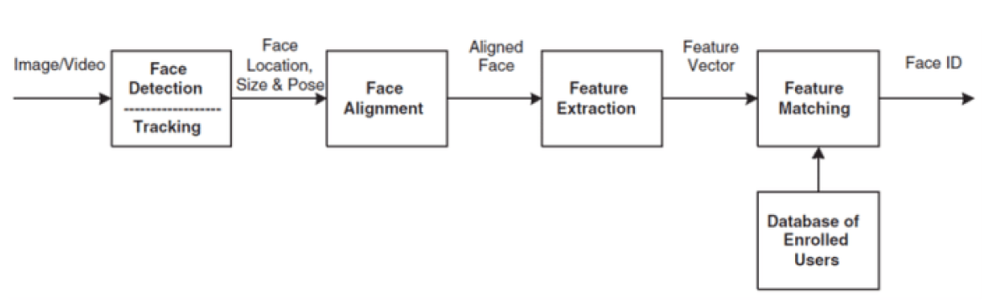

# Face Recognition

Facial Recognition System Using Deep Learning

## About the Internship

This work was done by me as a part of summer internship 2019-20 at my University NIT Surat under [Dr. K.P.Upla](https://sites.google.com/site/kpupla/home). I began my journey in Deep Learning through this internship and worked on the FaceNet system proposed by Google.

Worked on different submodules like Face Detection, Face Alignment and recognition through FaceNet's Inception model and carried out experiments on custom made dataset of 25 students.

## System Overview

1. Face detection in a video frame 
2. Cropping and aligning the detected faces. 
3. Face Recognition using CNN Model.

For further details please go through the report.

## REFERENCES
1) Y. Bengio, J. Louradour, R. Collobert, and J. Weston. Curriculum learning. In Proc. of ICML, New York, NY, USA, 2009.
2) I. J. Goodfellow, D. Warde-farley, M. Mirza, A. Courville, and Y. Bengio. Maxout networks. In In ICML, 2013.
3) G. B. Huang, M. Ramesh, T. Berg, and E. Learned-Miller. Labeled faces in the wild: A database for studying face recognition in unconstrained environments. Technical Report 07-49, University of Massachusetts, Amherst, October 2007.
4) F.Schroff, D. Kalenichenko, J.Philbin. FaceNet: A Unified Embedding for Face Recognition and Clustering, Google Inc.
5) Davidsandberg. Github Repository FaceNet available at https://github.com/davidsandberg/facenet.
6) TessFerrandez. FaceNet Paper Review available at https://github.com/TessFerrandez/research-papers
7) B.Amos, B.Ludwiczuk, M. Satyanarayanan. OpenFace. CMU School Of Computer Science, 2016.
8) Davis King. Dlib: Face Detection and Alignment.
9) D. Chen, S. Ren, Y. Wei, X. Cao, and J. Sun. Joint cascade face detection and alignment. In Proc. ECCV, 2014.
10) Ian Goodfellow, Yoshua Bengio, Aaron Courville. Deep Learning available at
www.deeplearningbook.org

NOTE: Please let me know if I have missed any references.

